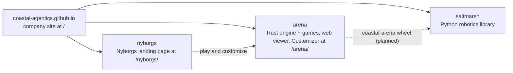

# coastal-agentics.github.io

The public website for **Coastal Agentics**, a Savannah, Georgia company that trains robots on the Georgia coast, alongside the people and industries that will work with them.

Served by GitHub Pages at <https://coastal-agentics.github.io> from the root of the `main` branch.

## How the repos fit

Coastal Agentics has four public repos. They all live in the [Coastal-Agentics](https://github.com/Coastal-Agentics) GitHub org, and their sites are served together under one host.



| Repo | What it is | Owner |
| --- | --- | --- |
| [coastal-agentics.github.io](https://github.com/Coastal-Agentics/coastal-agentics.github.io) | The company site, served at `/` ([site](https://coastal-agentics.github.io/)) | Soundwave (legal pages: Onslaught) |
| [nyborgs](https://github.com/Coastal-Agentics/nyborgs) | The Nyborgs landing page, served at `/nyborgs/` ([site](https://coastal-agentics.github.io/nyborgs/)) | Blitzwing |
| [arena](https://github.com/Coastal-Agentics/arena) | The Rust engine (`engine`, `engine-cli`, `engine-wasm`, and `engine-py`, the `coastal-arena` Python wheel) plus the Tank Arena and racing games, the web viewer and the Nyborg Customizer, served at `/arena/` ([site](https://coastal-agentics.github.io/arena/)) | Engine: Shockwave. Games, web viewer and Customizer: Blitzwing |
| [saltmarsh](https://github.com/Coastal-Agentics/saltmarsh) | The Python robotics library: MuJoCo simulation, datasets, behavior and evaluation, and the robot arm demo | Shockwave |

"Saltmarsh" means only the Python robotics library. The engine is the Arena engine, and it lives in `arena`.

## What's here

| File | Purpose |
| --- | --- |
| `index.html` | The whole site: hero, what we do, what we believe, Saltmarsh (research tool), projects (Nyborgs, Arena, next experiment), work with us, footer |
| `style.css` | All styles. System fonts, no framework |
| `logo.svg` | The mark: a solid C and a triangular A that overlap, with a hairline wave knocked out of both |
| `logo-wordmark.svg` | The mark plus "Coastal Agentics" |
| `favicon.svg` | The mark without the wave, cropped for 16 to 32px browser tabs |
| `og-image.png` | 1200x630 social preview card |
| `404.html` | Not-found page. Self-contained (inline CSS and SVG) because Pages serves it at any missing path |
| `.nojekyll` | Tells Pages to serve the files as-is |
| `CARD.md` | Provenance card |

## Principles

- No build step, no framework, no trackers, no external requests except outbound links.
- Relative links for this site's own pages and assets, so it also works from a subpath or a local folder. The exceptions are the home link on `404.html` (`/`) and the links to the two project sites, which are root-relative: `/nyborgs/` ([Coastal-Agentics/nyborgs](https://github.com/Coastal-Agentics/nyborgs)) and `/arena/` ([Coastal-Agentics/arena](https://github.com/Coastal-Agentics/arena)). GitHub Pages serves both under this site's host, and they will follow it to its own domain.
- The three sites share one header pattern (wordmark home, Nyborgs, Arena), the footer and these tokens, so they read as one business.
- Palette (tonal grey-blue, from the logo): C `#436A95`, A `#5F88B7`, overlap `#34557B`, background `#EEF2F6`, text `#1F3147`.
- Social meta tags (`og:*`, `twitter:*`) use absolute URLs, because crawlers require them.

## Local preview

```sh
python3 -m http.server 8000
# open http://localhost:8000
```

## Editing

Edit `index.html` directly. Keep the copy faithful to the Coastal Agentics manifesto, and update `CARD.md` when the sources change.
